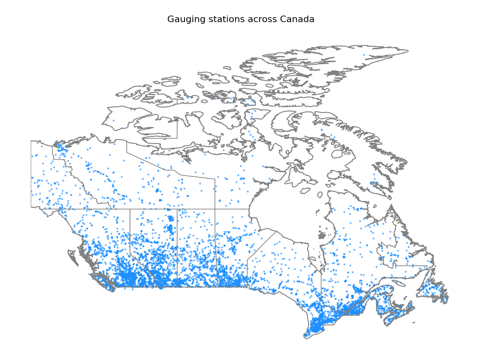
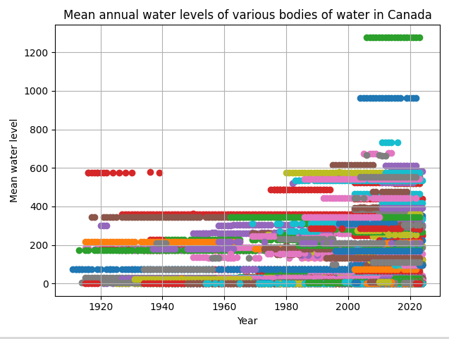
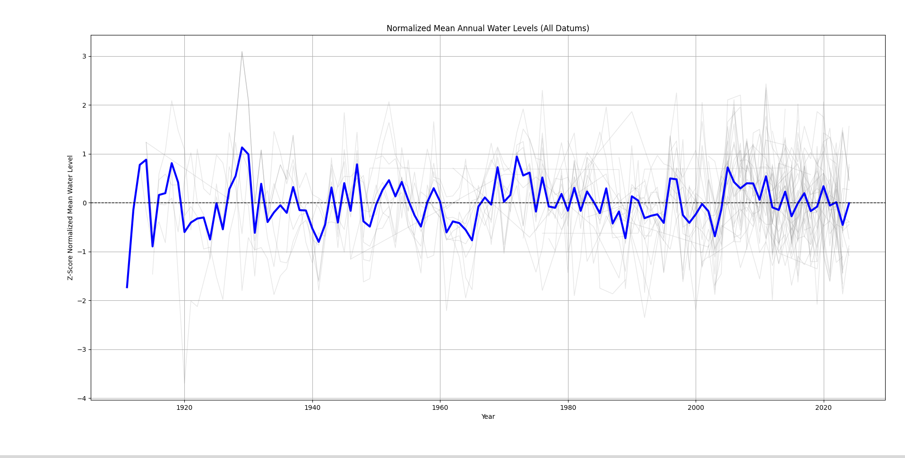
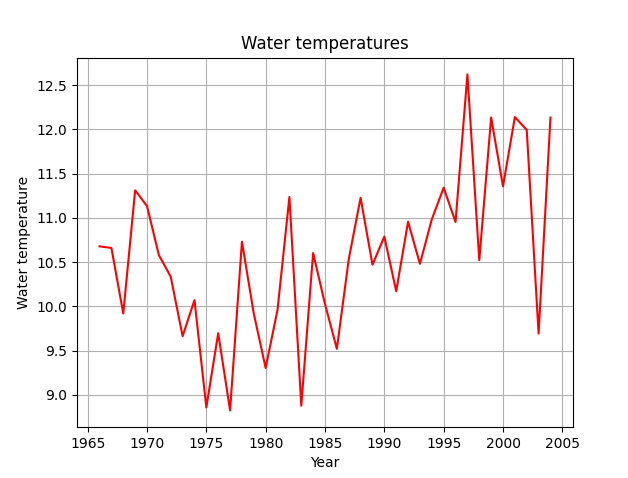

I want to preface this by saying that you should take my analysis with a grain
of salt. I most likely made a mistake or an oversight somewhere, so my results
aren't perfect. What’s more interesting for me, is how I approached the analysis
and what I learnt about data analysis tools like pandas and matplotlib.

With climate change driving rising sea levels and global temperatures,
it seems intuitive that landlocked bodies of water—like lakes—would be affected too.
In fact, the [EPA](https://www.epa.gov/climate-indicators/great-lakes) has shown
that water levels and temperatures in the Great Lakes have risen slightly in recent decades.

This made me wonder: what about other bodies of water, specifically in Canada?
Canada is home to a huge number of lakes, around 62% of all lakes on Earth, so it's
a relevant question. This analysis explores whether Canadian water levels,
and temperatures have also increased.

After a little bit of digging, I found
[this dataset](https://collaboration.cmc.ec.gc.ca/cmc/hydrometrics/www/) from
the government of Canada. It contains daily and monthly measurements for water flow,
levels, and sediment concentrations from gauging stations across the country.
The data is packaged in an SQLite3 database, making it straightforward to load into
a pandas DataFrame.

```py
def get_dataset():
    base_url = "https://collaboration.cmc.ec.gc.ca/cmc/hydrometrics/www/"
    soup = bs4.BeautifulSoup(requests.get(base_url).text, "html.parser")

    # anything that contains _sqlite3_ and ends in .zip
    pattern = re.compile(r".*_sqlite3_.*\.zip")

    links = [l for l in soup.find_all("a") if pattern.match(l.get_text())]
    filename = links[0]["href"]

    response = requests.get(f"{base_url}{filename}")
    with open("dataset.zip", "wb") as output:
        output.write(response.content)

    with zipfile.ZipFile("dataset.zip", 'r') as zip_ref:
        zip_ref.extractall("dataset")

    files = glob.glob('./dataset/*.sqlite3', recursive=True)
    os.remove("dataset.zip")
    return files[0]

path = get_dataset()
connection = sqlite3.connect(path)
values = pd.read_sql_query("SELECT * from ANNUAL_STATISTICS", connection)
```

I focused on the ANNUAL_STATISTICS table, which contains annual summaries from
different gauging stations across Canada.
```
       STATION_NUMBER DATA_TYPE  YEAR          MEAN  ...  MAX_MONTH  MAX_DAY       MAX MAX_SYMBOL
0             01AA002         Q  1969     18.000000  ...        4.0     18.0     161.0       None
1             01AA002         Q  1970     15.900000  ...        4.0     26.0     280.0          B
2             01AA002         Q  1971     14.200000  ...        8.0     29.0     213.0       None
...
```

To start, I plotted the mean water levels over the years from each gauging station.
I chose to use the mean, because I also graphed the min and max and found that they
looked quite similar.
```py
values = pd.read_sql_query("SELECT * from ANNUAL_STATISTICS", connection)
water_levels = values[values["DATA_TYPE"] == "H"]

station_numbers = water_levels["STATION_NUMBER"].unique()
unregulated = [s for s in station_numbers if is_not_regulated(s, connection)]

for station_number in unregulated:
    station = Station(station_number)
    station_data = water_levels[water_levels["STATION_NUMBER"] == station.number]
    station_data = station_data.sort_values(by="YEAR")

    # replace each NaN with the previous valid value
    station_data["MEAN"] = station_data["MEAN"].ffill()

    plt.plot(station_data["YEAR"], station_data["MEAN"], '-', label=station.name)

plt.title(f"Mean annual water levels of various bodies of water in Canada")
plt.xlabel("Year")
plt.ylabel("Mean water level")
plt.grid(True)
plt.tight_layout()
plt.show()
```
That gave me a graph that looked like this:


As we can see, each station has different baselines for water levels, so the graph's
too noisy. My second approach involved aggregating data from multiple gauging
stations by calculating the average annual water level across all stations each year.
This would mean that we're not placing less emphasis on each individual water station
and more on the whole of Canada.

```py
values = pd.read_sql_query("SELECT * from ANNUAL_STATISTICS", connection)
water_levels = values[values["DATA_TYPE"] == "H"]

station_numbers = water_levels["STATION_NUMBER"].unique()
unregulated_stations = [s for s in station_numbers if is_not_regulated(s, connection)]

# only want water sources that aren't regulated
filtered = water_levels[water_levels["STATION_NUMBER"].isin(unregulated_stations)].copy()

filtered = filtered.sort_values(by=["STATION_NUMBER", "YEAR"])

filtered = filtered.dropna(subset=["MEAN"]) # remove NaNs

# group duplicate years from different stations together, and average the means
mean_water_levels_by_year = filtered.groupby("YEAR")["MEAN"].mean()

plt.plot(mean_water_levels_by_year.index, mean_water_levels_by_year.values)
plt.title(f"Mean annual water levels of various bodies of water in Canada")
plt.xlabel("Year")
plt.ylabel("Mean water level")
plt.grid(True)
plt.tight_layout()
plt.show()
```

Which gave us a graph that looks like this:


Which is much better. But the graph still seems wrong. It looks like there was this
massive spike in water level in the 1920s, but that doesn't make sense, since the
1920s in Canada were characterized by drought.

I thought about it some more, looking at the database reference more closely.
Then it hit me, *each station is using a different
[datum](https://wateroffice.ec.gc.ca/report/datum_faq_e.html)*. A datum in this context is
a reference surface for elevations.  For example, in Canada a common standard vertical
datum is CGVD2013 (Canadian Geodetic Vertical Datum of 2013). It uses a surface
called a geoid as its reference. The geoid is an [equipotential](https://en.wikipedia.org/wiki/Equipotential) surface of the Earth's gravity field, which closely approximates average
sea level globally (but can vary because of gravity differences). So, water levels
measured relative to CGVD2013 are effectively measured relative to the Earth's
gravity defined average sea level.

Since each gauging station is using a different datum, we have 2 main options.
We can try to convert all the stations to a common datum. But, looking through
the dataset:
```
     STATION_NUMBER  DATUM_ID_FROM  DATUM_ID_TO  CONVERSION_FACTOR
0           01AD009            405          415         168.270996
1           01AD014            405          415         162.388000
2           01AF003             10           35         141.917999
...
```
it seems as though there isn't a common datum that each station can convert to.

Which leaves us with the second option, which is to analyze water levels
per each datum. So for each datum, we take all the stations that are
already using that datum. We also take all the stations that can have
their water levels converted to that datum and convert the water levels
(just adding the conversion factors). And now that the datums are the same
we can continue graphing like before.

So using CGVD2013  like before, we get this graph:


This looked much more believable. We do see a huge spike in water level in
the 1960s that's suspect, specifically in 1964, but this is something we can explain.
Since in 1964, there was a tsunami that affected the British Columbia coast, and
severe flooding in Alberta and Saskatchewan from heavy rainfall and runoff. But
this is just one datum, we need to consider all of them.

To do that, we can superpose all the graphs together.

```py
def z_score_normalize(group):
    return (group - group.mean()) / group.std()

# get the most frequently used datums
conversions = pd.read_sql_query("SELECT * from STN_DATUM_CONVERSION", connection)
datum_usage_counts = conversions.groupby("DATUM_ID_TO")["STATION_NUMBER"].count()
most_used_datums = datum_usage_counts.sort_values(ascending=False).index.tolist()

stations = pd.read_sql_query("SELECT * from STATIONS", connection)

annual_statistics = pd.read_sql_query("SELECT * from ANNUAL_STATISTICS", connection)
all_water_levels = annual_statistics[annual_statistics["DATA_TYPE"] == "H"] # T = daily mean tonnes, Q = flow

all_stations = all_water_levels["STATION_NUMBER"].unique()
datums_used = stations[stations["STATION_NUMBER"].isin(all_stations)]["DATUM_ID"].unique()

# only consider water sources that haven't been regulated
# NOTE: try toggling this on/off because there is a difference
regulation_data = pd.read_sql_query("SELECT * FROM STN_REGULATION", connection)
regulated_stations = regulation_data.loc[regulation_data["REGULATED"] == 1, "STATION_NUMBER"]
unregulated_stations = set(all_stations) - set(regulated_stations)
all_water_levels = all_water_levels[all_water_levels["STATION_NUMBER"].isin(unregulated_stations)]

column = "MEAN"
yearly_station_data = []

for target_datum in most_used_datums:
    # only select water level data that uses a common datum or can be converted to the common datum
    stations_already_with_datum = stations[stations["DATUM_ID"] == target_datum]["STATION_NUMBER"].copy()
    water_levels_using_datum = all_water_levels[all_water_levels["STATION_NUMBER"].isin(stations_already_with_datum)]

    conversions = pd.read_sql_query("SELECT * from STN_DATUM_CONVERSION", connection)
    convertible_stations = conversions[conversions["DATUM_ID_TO"] == target_datum]

    # add the conversion factor column to corresponding station numbers
    water_levels_with_conversion_factor = pd.merge(
        all_water_levels,
        convertible_stations[["STATION_NUMBER", "CONVERSION_FACTOR"]],
        on="STATION_NUMBER",
        how="inner"
    )
    water_levels_with_conversion_factor[column] += water_levels_with_conversion_factor["CONVERSION_FACTOR"]

    # remove the conversion factor column since we don't need it anymore
    water_levels_with_conversion_factor.drop(columns="CONVERSION_FACTOR", inplace=True)

    # now all the water level data are using the same datum
    water_levels = pd.concat([water_levels_using_datum, water_levels_with_conversion_factor], ignore_index=True)

    # remove rows where the min, max and mean are nan
    water_levels = water_levels.dropna(subset=[column], how="all")

    # replace nans with the last valid value
    # min-max normalize so that each graph has the same scale, regardless of datum
    water_levels[column] = water_levels.groupby("STATION_NUMBER")[column].transform(lambda x: x.ffill())
    water_levels[column] = water_levels.groupby("STATION_NUMBER")[column].transform(z_score_normalize)

    # group duplicate years from different stations together, and average the means
    mean_water_levels_by_year = water_levels.groupby("YEAR")[column].mean()

    mean_water_levels_by_year = water_levels.groupby("YEAR")[column].mean().reset_index()
    yearly_station_data.append(mean_water_levels_by_year)

# fainty show each plot
for plot in yearly_station_data:
    plt.plot(plot["YEAR"], plot["MEAN"], color="grey", linewidth=1, alpha=0.2)

# concatenate all normalized station-year means across all datums
combined = pd.concat(yearly_station_data, ignore_index=True)

# compute and plot overall trend line (average of all stations by year)
overall_trend = combined.groupby("YEAR")[column].mean()
plt.plot(overall_trend.index, overall_trend.values, color="blue", linewidth=3)

# draw the middle line (z-score always has a normalized mean of zero)
plt.axhline(0, color="black", linestyle="--", linewidth=1)

column_str = column[0] + column[1:].lower()
plt.title(f"Normalized {column_str} Annual Water Levels (All Datums)")
plt.xlabel("Year")
plt.ylabel(f"Z-Score Normalized {column_str} Water Level")
plt.grid(True)
plt.tight_layout()
plt.show()
```

Which gives us this graph:


In grey, we have the water levels collected using different datums,
and in blue, we have the main trend line.
From the graph, we can see that there aren't actually any long term trends.
The water levels have remained fairly consistent throughout the decades.

The sediment sampling data also did include water temperatures.
So I plotted the mean water temperature per year:
```py
samples = pd.read_sql_query(
    "SELECT DATE, TEMPERATURE FROM SED_SAMPLES WHERE TEMPERATURE IS NOT NULL ORDER BY DATE",
    connection
)
samples["DATE"] = pd.to_datetime(samples["DATE"])
samples = samples.set_index("DATE")

samples = samples[samples.index >= "1965-01-01"] # ignore erroneuous data
yearly_means = samples.resample("YE").mean().reset_index()

plt.plot(yearly_means["DATE"], yearly_means["TEMPERATURE"], color="red")

plt.title("Water temperatures")
plt.xlabel("Year")
plt.ylabel("Water temperature")
plt.grid(True)
plt.show()
```



So while the water levels have stayed consistent, the water temperatures have
been slowly rising over the decades. So, part of my original hypothesis, that water levels
would rise, was wrong.

And that makes sense. While climate change is driving up global temperatures,
landlocked bodies of water aren't guaranteed to see rising water levels unless
there's a significant shift in precipitation or inflow patterns. Still, the
stability of water levels doesn’t mean these ecosystems are safe — rising temperatures
and changing climates continue to pose serious risks. That’s why it's important
that we develop and implement effective solutions to mitigate the
broader impacts of climate change.
