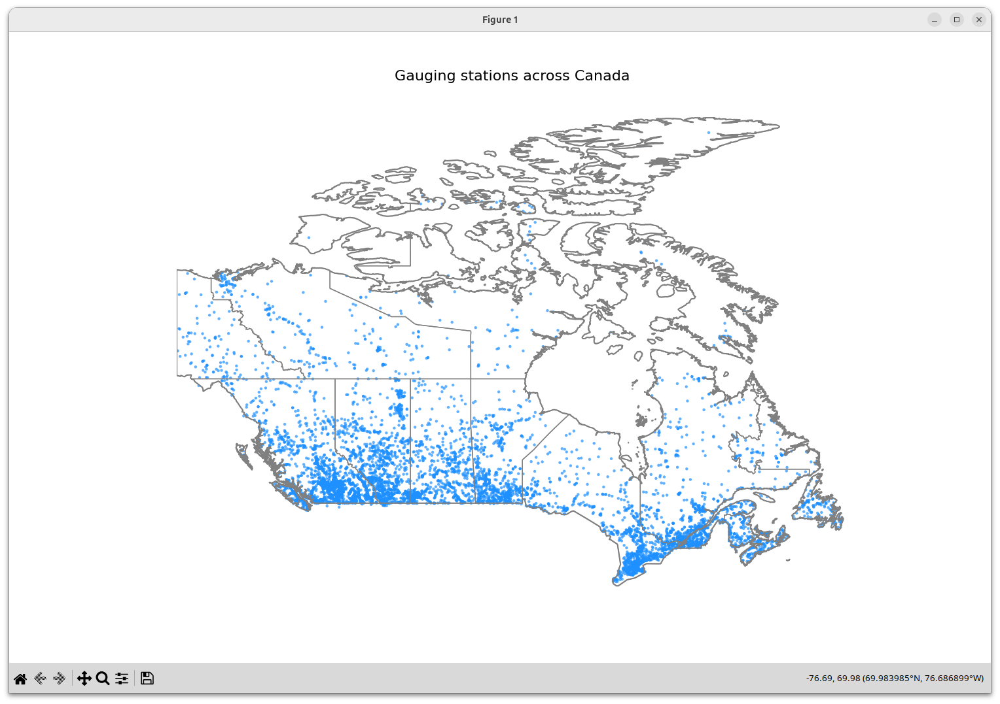
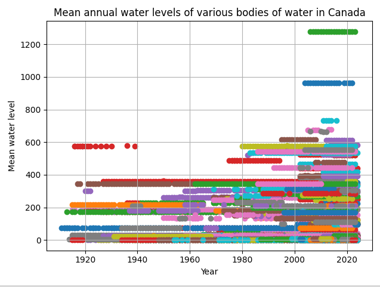
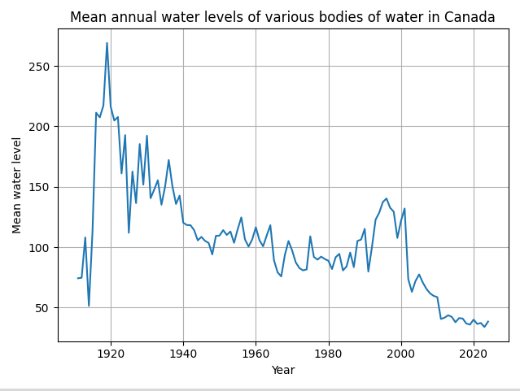
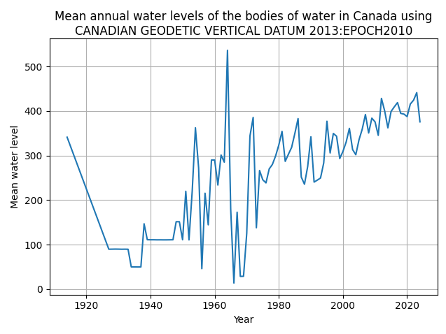
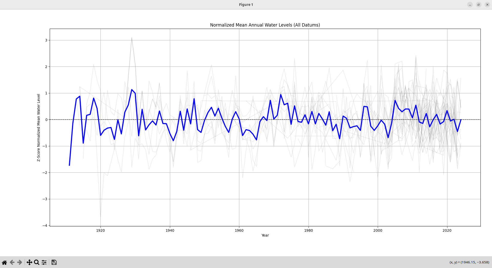

I want to preface this by saying that you should take my analysis with a grain
of salt. I probably made a mistake or an oversight somewhere, so my reuslts are
probably not correct. But, perhaps these findings might be a little interesting.

Due to climate change, sea levels and global temperatures are rising.
Intuitively, it seems that land locked bodies of water, like lakes would
also be affected. In fact, the EDA did an
[analysis](https://www.epa.gov/climate-indicators/great-lakes) that showed
that the water levels and temperatures of the great lakes have risen slightly.
Which makes me wonder, what about the bodies of water in Canada?
Canada happens to have a lot of lakes. In fact, roughly 62% of the lakes on this
planet are in Canada. So this analysis will look at the water levels, water flow rates
and temperatures of the various bodies of water in Canada to see if they too are increasing.

After a little bit of digging, I found [this dataset](https://collaboration.cmc.ec.gc.ca/cmc/hydrometrics/www/) from the government of Canada. This dataset is comprised of the daily and monthly means of flow, water levels and sediment concentrations (for sediment sites) from all the gauging stations in Canada.

The dataset was packaged as an sqlite3 database, so downloading it and loading it into a
pandas dataframe was pretty trivial. 
```py
def get_dataset():
    base_url = "https://collaboration.cmc.ec.gc.ca/cmc/hydrometrics/www/"
    soup = bs4.BeautifulSoup(requests.get(base_url).text, "html.parser")

    # anything that contains _sqlite3_ and ends in .zip
    pattern = re.compile(r".*_sqlite3_.*\.zip")

    links = [l for l in soup.find_all("a") if pattern.match(l.get_text())]
    filename = links[0]["href"]

    response = requests.get(f"{base_url}{filename}")
    with open("dataset.zip", "wb") as output:
        output.write(response.content)

    with zipfile.ZipFile("dataset.zip", 'r') as zip_ref:
        zip_ref.extractall("dataset")

    files = glob.glob('./dataset/*.sqlite3', recursive=True)
    os.remove("dataset.zip")
    return files[0]

path = get_dataset()
connection = sqlite3.connect(path)
```

From the database, the ANNUAL_STATISTICS table would give us the data we needed.
```
TODO: put the pandas output for the table
```

My initial course of action was to plot the mean water levels over the years from each gauging station. I chose to use the mean, because I also graphed the min and max and found that they looked nearly identical.
```py
# TODO: put the main code from the first commit
```
That gave me a graph that looked like this:


As we can see, each station has different baselines for water levels, so the graph
doesn't really tell us much, as it's discontinuous.

My second approach involved aggregating water level data from multiple monitoring
stations by calculating the average annual water level across all stations each year.
This would mean that we're not placing less emphasis on each individual water station
and more on the whole of Canada.

Which gave us a graph that looks like this:


Which is much better. But the graph still seems wrong. It looks like there was this
massive spike in water level in the 1920s, but that doesn't make sense, since the
1920s in Canada were characterized by drought.

I thought about it some more, looking at the database reference more closely.
Then it hit me, *each station is using a different
[datum](https://wateroffice.ec.gc.ca/report/datum_faq_e.html)*! A datum in this context is
a reference surface for elevations.  For example, in Canada a common standard vertical
datum is CGVD2013 (Canadian Geodetic Vertical Datum of 2013). It uses a surface
called a geoid as its reference. The geoid is an [equipotential](https://en.wikipedia.org/wiki/Equipotential) surface of the Earth's gravity field, which closely approximates average
sea level globally (but can vary because of gravity differences). So, water levels
measured relative to CGVD2013 are effectively measured relative to the Earth's
gravity defined average sea level.

Since each gauging station is using a different datum, we have 2 main options.
We can try to convert all the stations to a common datum. But, looking through
the dataset:
```
     STATION_NUMBER  DATUM_ID_FROM  DATUM_ID_TO  CONVERSION_FACTOR
0           01AD009            405          415         168.270996
1           01AD014            405          415         162.388000
2           01AF003             10           35         141.917999
3           01AG002             10           35         104.588997
4           01AG003             10           35          75.311996
...             ...            ...          ...                ...
2034        11AC062             10           35         794.437988
2035        11AC063             35           90          -0.064000
2036        11AC065             35           90          -0.014000
2037        11AC066             10           35         824.281006
2038        11AC068             10           35         808.161011
```
it seems as though there isn't a common datum that each station can convert to.
But it seems like (TODO: list the datums) are the most common.

Which leaves us with the second option, which is to analyze water levels
per each datum. So for each datum, we take all the stations that are
already using that datum. We also take all the stations that can have
their water levels converted to that datum and convert the water levels
(just adding the conversion factors). And now that the datums are the same
we can continue graphing like before.

So using CGVD2013  like before, we get this graph:


Which is much better. We do see a huge spike in water level in the 1960s, that's suspect,
specifically in 1964, but this is something we can explain. Since in 1964, there was a
tsunami that affected the British Columbia coast, and severe flooding in Alberta and Saskatchewan
from heavy rainfall and runoff. But this is just one datum, we need to consider all of them.

To do that, we can superpose all the graphs together.

```py
TODO: show the code
```

Which gives us this graph:


From the graph, we can see that there aren't actually any long term trends.
The water levels have remained fairly consistent throughout the decades.
So from this, we could say that climate change isn't having an effect on the water
levels of land locked bodies. But maybe that isn't the full story...

## Plot
- plot of canada with the ground transparent and the lakes sticking out
Show picture of different plots.
Explain what they show, different statistics.
- Water levels of the lakes
- Acidity?
- Rate of change in water level
- Size of the lakes
- Etc

### Conclusion
Obviously, the factors I looked at aren't all the factors that could contribute. However, even from them,
we see that X.

What does this data support/not support?
Prediction: build an ml model to predict one of the above questions.

You can find my analysis in [this]() jupyter notebook
